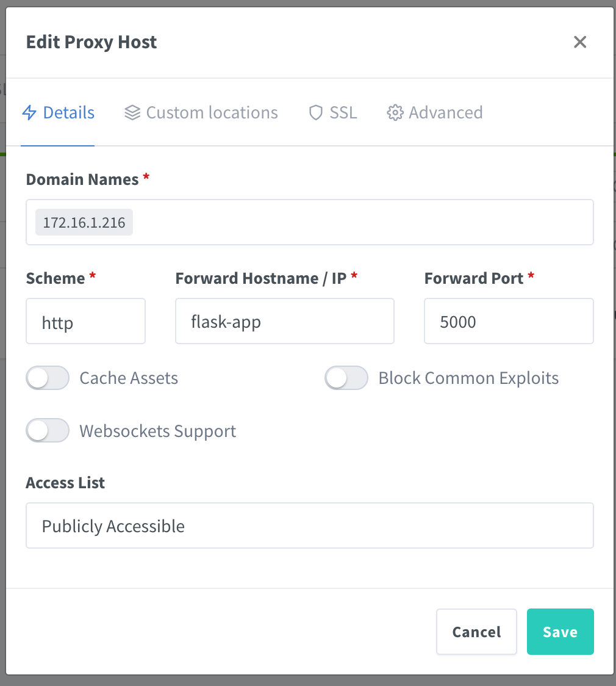

## Scalling horizontal

Nous allons ici mettre en place un reverse proxy tres simpel a l'aide de Nginx Proxy Manager pour deployer des container de type Flask(python).

### Introduction

*Scalling horizontal* : \
Le "Scaling horizontal" (mise à l'échelle horizontale) est une technique de gestion de la charge dans laquelle de nouvelles instances ou serveurs sont ajoutés à un système ou une application existante afin de répartir la charge de manière équilibrée. Cette approche vise à améliorer les performances et la disponibilité en permettant au système de gérer un plus grand nombre de requêtes ou d'utilisateurs tout en maintenant une qualité de service élevée. Elle est souvent utilisée dans les environnements informatiques cloud et les applications Web pour garantir une extensibilité efficace.

*Scalling vertical* : \
Le "Scaling vertical" (mise à l'échelle verticale) est une technique de gestion de la charge dans laquelle les ressources d'un serveur ou d'une instance existante sont augmentées, généralement en ajoutant plus de puissance de calcul, de mémoire ou d'autres ressources matérielles. Contrairement au "Scaling horizontal" qui consiste à ajouter davantage de serveurs ou d'instances, le scaling vertical implique d'optimiser les ressources d'une seule machine pour améliorer ses performances. Cela peut être utile pour des charges de travail spécifiques qui nécessitent plus de ressources, mais il peut atteindre une limite en termes de capacité matérielle disponible sur une seule machine.

Il est important de placer le .env de le gitignore pour pas publier nos informations personnel, !
Par contre il est important de ne pas le placer dans le dockerignore car docker en a besoin etant donné qu'on utilise ldes variabel d'env dans le docker-compose.

## Mise en place de l'app

L'application en place se limite à renvoyer une chaîne de caractères sur l'URL de base de l'application web.

```python
from flask import Flask
import socket

app = Flask(__name__)

@app.route('/')
def hello_world():
    host_name = socket.gethostname()
    return f'Hello, World from Flask! Running on container: {host_name}'

if __name__ == '__main__':
    app.run(host='0.0.0.0', port=5000)

```

## Docker File

```Dockerfile
# Utilise une image de base Python officielle
FROM python:3.9-slim

# Définit le répertoire de travail
WORKDIR /app

# Copie les fichiers requis dans le conteneur
COPY . /app

# Installe Flask
RUN pip install flask

# Expose le port sur lequel l'application s'exécutera
EXPOSE 5000

# Commande pour exécuter l'application
CMD ["python", "./app.py"]
```

## Docker Compose

Ici nous allons desactiver les parametre en rapport avec le ssl et le https pour ne pas rallonger ce tutoriel.

```docker-compose
version: '3.8'

services:
  flask-app:
    build: . # Chemin vers le répertoire contenant le Dockerfile de Flask

  nginx-proxy-manager:
    image: 'jc21/nginx-proxy-manager'
    restart: unless-stopped
    depends_on:
      - db-proxy
    ports:
      - '80:80' # Port HTTP
      - '81:81' # Interface d'administration NPM
    environment:
      DB_MYSQL_HOST: db-proxy
      DB_MYSQL_PORT: 3306
      DB_MYSQL_USER: ${MYSQL_USER}
      DB_MYSQL_PASSWORD: ${MYSQL_PASSWORD}
      DB_MYSQL_NAME: ${MYSQL_DATABASE}
      DISABLE_HTTPS: 'true' # A desactiver en production
      #DISABLE_IPV6: 'true' # A activer pour certains conteneurs
    volumes:
      - proxy-data:/data
      #- proxy-letsencrypt:/etc/letsencrypt

  db-proxy:
    image: 'jc21/mariadb-aria'
    restart: unless-stopped
    environment:
      MYSQL_ROOT_PASSWORD: ${MYSQL_ROOT_PASSWORD}
      MYSQL_DATABASE: ${MYSQL_DATABASE}
      MYSQL_USER: ${MYSQL_USER}
      MYSQL_PASSWORD: ${MYSQL_PASSWORD}
    volumes:
      - db-proxy-data:/var/lib/mysql

volumes:
  proxy-data:
  proxy-letsencrypt:
  db-proxy-data:
```

## .env

Ici nous allons placer nos variable d'environement necessaire et inscrite dans notre fichier docker-compose.yaml

```env
MYSQL_ROOT_PASSWORD=proxy
MYSQL_DATABASE=proxy
MYSQL_USER=proxy
MYSQL_PASSWORD=proxy
```

## .gitignore

Penser a placer ce fichier dans le point .gitignore pour de na reveller les données sensible

```gitignore
.env
```


## Lancer l'app

Une fois l'app en place, lancer le container en local :

```zsh
docker-compose up
```
Puis consulter l'url :

```djangourlpath
http://localhost:81/login
```

Connectez vous :

Email:    admin@example.com \
Password: changeme

## Proxy Setup

CLiquer sur  'Proxy host' puis sur  'Add Proxy Host'.

Dans cet input saisissez l'adresse ip de l'host de la machine. Attention a ne pas mettre localhost car nginx vas l'interpretter comme "lui meme".
ipconfig ou ifconfig pour recuperer son adresse ip 

```zsh
ipconfig (Windows : Recuperer adresse ip Eth0)
ifconfig (Linux : Recuperer adresse ip en0)
```

Ensuite je vais preciser dans forward hostname ip le nom de domaine interne de l'ap *flask-app* precisé dans le fichier *docker-compose.yaml*.

```yaml
services:
  flask-app:
    build: . # Chemin vers le répertoire contenant le Dockerfile de Flask
```

Puis precisr le port que l'on a inscrit precedement dans le Dockerfile.

```yaml
# Expose le port sur lequel l'application s'exécutera
EXPOSE 5000
```



Cliquer sur Valider.

Puis aller dans un navigateur puis consulter l'adresse ip inscrit preceddement.


## Créations multiple de containers

Maintenant nous allons ouvrir un nouveau terminal puis executer la commande suivante : 

```zsh
docker-compose up -d --scale flask-app=3
```

Trois nouvelles instance vont etre crée, vous pouvez ocnstater le resultat en regardant l'interface de docker ou en utilisant le terminal.


# Flask-Reverse-Proxy
